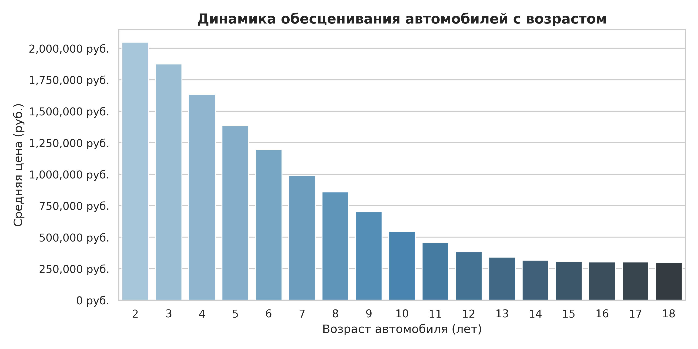
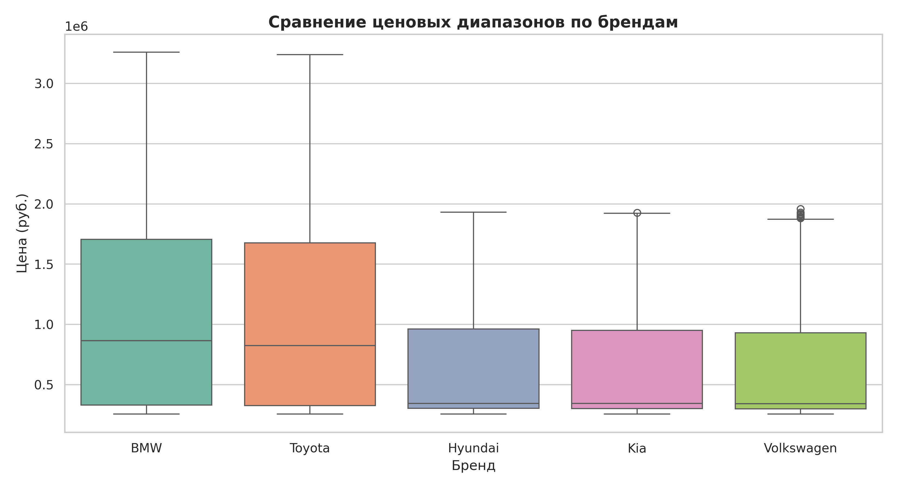
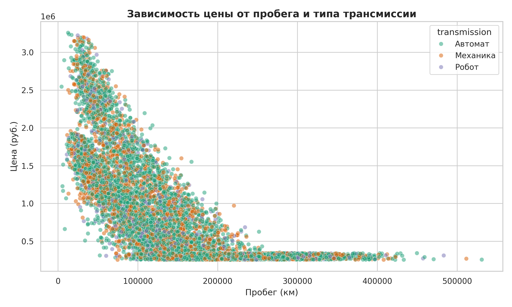

# 🚗 End-to-End Анализ ценообразования и факторов ликвидности на вторичном авторынке

## 📌 Описание проекта
Комплексное исследование вторичного автомобильного рынка (10 000 объявлений). В рамках проекта проведен полный цикл работы с данными: от очистки сырого датасета от аномалий и пропусков до сложного SQL-анализа с оконными функциями и построения бизнес-визуализаций.

## 🛠️ Стек технологий
* **Python:** Pandas, NumPy, Matplotlib, Seaborn
* **SQL / Database:** SQLite, оконные функции (`AVG() OVER()`, `ROW_NUMBER()`), CTE, агрегации
* **Environment:** Google Colab, Jupyter Notebook, Git/GitHub

## 📊 Ключевые бизнес-выводы
1. **Динамика обесценивания:** Наиболее резкое падение стоимости происходит в первые 3–5 лет эксплуатации автомобиля (до 30–35% от базовой цены), после чего темп обесценивания замедляется до 3–5% в год.
2. **Премиум vs Масс-маркет:** Сегмент премиальных авто (BMW) демонстрирует наибольший разброс цен и повышенную чувствительность стоимости к годовому пробегу.
3. **Фактор трансмиссии:** Автомобили с автоматической коробкой передач удерживают высокую цену на 15–20% дольше аналогичных моделей на механике при одинаковом возрасте и пробеге.

## 📈 Визуализации

## 📂 Структура репозитория
* `car_analytics_project.ipynb` — Полный код обработки данных на Python, EDA и построения графиков.
* `used_cars_clean.csv` — Очищенный датасет с рассчитанными метриками (`car_age`, `km_per_year`).
* `*.png` — Экспортированные графики для отчета.
